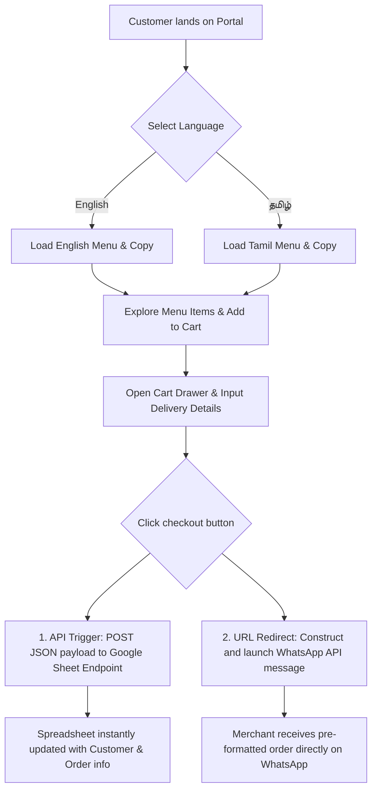

# Proof of Concept (PoC) Document: Ramesh's Poli & Sweets Web Portal

This document serves as the official **Proof of Concept (PoC)** for the modern, high-end, bilingual e-commerce and order management portal for **Ramesh's Poli & Sweets**. It outlines the project's architecture, design philosophy, technical stack, premium user interactions, and integration logic.

---

## 1. Executive Summary
The primary objective of this project is to elevate the digital presence of **Ramesh's Poli & Sweets** (a traditional brand with **20+ years** of authentic heritage) into an premium, modern web experience. 

The portal serves as a frictionless bridge between traditional culinary art and automated digital sales. It features an interactive, high-end visual menu, a dual-channel ordering system (direct WhatsApp routing + automated Google Sheets order tracking), and immersive web animations (magnetic physics, custom elastic cursors, and cinematic parallax scrolling) designed to convey luxury and culinary expertise.

---

## 2. Technical Stack
The application is engineered using a high-performance, lightweight **Vanilla Web Stack** to guarantee instantaneous loading times, high search engine discoverability (SEO), and zero bloated dependencies.

*   **Core Architecture:** HTML5 (Semantic Structure) & ES6+ JavaScript (State & View management).
*   **Styling Engine:** Vanilla CSS3 utilizing customized HSL variables, fluid glassmorphic properties, and custom hardware-accelerated animations.
*   **Development Platform & Bundler:** **Vite 8.x** for rapid development cycles, instant hot module reloading (HMR), and highly optimized production builds.
*   **Integration Layer:** 
    *   **WhatsApp API:** Direct customer-to-merchant order formatting and communication.
    *   **Google Apps Script Web App:** Serverless JSON REST API endpoint designed to securely append order logs directly into a Google Spreadsheet in real-time.

---

## 3. System Architecture & Order Flow



---

## 4. Premium User Experience (UX) & Animation Systems
To deliver a custom, "expensive-feeling" user experience reminiscent of high-end digital design agencies, the following advanced animation layers have been developed:

### 4.1. Intelligent Elastic Cursor System
*   **Aesthetic:** A dual-element custom cursor consisting of a central primary dot and an elastic, lag-following outline.
*   **Micro-Interactions:** When hovering over interactive elements (buttons, links, product cards), the outline expands, blurs, and morphs into a glowing backdrop.
*   **Device Adaptability:** Using robust JavaScript touchpoint checks and CSS media queries (`hover: none`), the custom cursor completely disables itself on mobile/touch interfaces to ensure native tap responsiveness is preserved.

### 4.2. Magnetic Physics Buttons
*   **Concept:** Standard HTML buttons are given a magnetic pulling sensation when the cursor gets close.
*   **Implementation:** JavaScript calculates the mouse cursor’s relative distance to the center of the button, dynamically translating (`transform: translate(x, y)`) the button towards the cursor using custom spring physics.

### 4.3. Cinematic Scroll-Reveal & Parallax
*   **Intersection Observer API:** Sections dynamically slide up and fade into view as the user scrolls, creating a heavy, premium entrance.
*   **Ken Burns Parallax Header:** The background image of the hero section slowly scales up over a 20-second loop (`hero-pan`), paired with scroll-linked translations on the titles to create visual depth.
*   **Premium Story Frames:** The "Our Kutty Story" single image stays perfectly static inside its frame, while the image itself slowly zooms in on hover using custom `cubic-bezier(0.25, 0.46, 0.45, 0.94)` easing.

### 4.4. Seamless Bilingual Translation Engine
*   **Localization:** The entire portal dynamically translates between **English** and **தமிழ்** instantly without page refreshes, maintaining clean layouts and consistent typography.

---

## 5. Live Integrations (Order Management)

### 5.1. Direct WhatsApp Dispatch
The system generates a beautifully formatted, Markdown-supported WhatsApp message automatically populated with:
*   Unique Order ID (`ORD-xxxx`)
*   Customer full name, phone number, and delivery address
*   Detailed list of ordered items (e.g. `Paruppu Poli x 2`)
*   Subtotals, applied promotional discounts (e.g., Free Poli above ₹150), delivery fees, and final grand total.

### 5.2. Serverless Google Sheets Database
When an order is submitted, the system asynchronously makes a `POST` request to a Google Apps Script Web App URL:
```javascript
function syncToGoogleSheets(orderData) {
  const SCRIPT_URL = 'https://script.google.com/.../exec';
  fetch(SCRIPT_URL, {
    method: 'POST',
    mode: 'no-cors',
    body: JSON.stringify(orderData)
  });
}
```
This appends the order to a secure Google Spreadsheet spreadsheet, providing the merchant with a live database of all sales, delivery conditions, and customer records.

---

## 6. Verification and Deployment
The codebase is structured for simple deployment and instant scalability.
*   **To run locally:**
    1. Install dependencies: `npm install`
    2. Start local server: `npm run dev`
*   **Production Deployment:** Can be instantly hosted on global edge platforms like Vercel, Netlify, or GitHub Pages.
